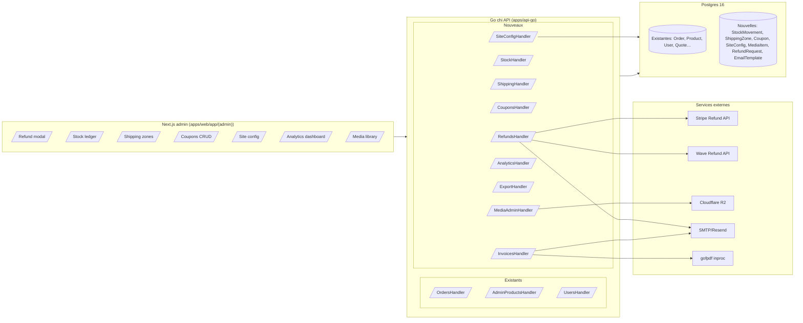
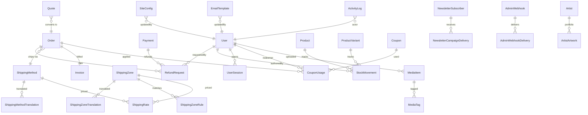

# Back-office Roadmap — RBS Crew SN

**Auteur** : Cheikh (architecte back-end e-commerce)
**Destinataire** : Mounzil (dev backend/frontend)
**Date** : 2026-07-11
**Statut** : Draft — à valider avec Mounzil avant sprint 1
**Repo** : `/home/zone01/RBS_Crew_SN`
**Scope** : Combler les gaps du back-office admin, tout pilotable via UI.

---

## 1. Vue d'ensemble

### 1.1 Objectifs

Rendre le back-office admin de RBS Crew SN **opérationnel de bout en bout** pour la vente en ligne (products, orders, quotes) et la gestion éditoriale (pages, artistes, festivals). Objectif business : réduire les tickets support "où est ma commande", supprimer toute action manuelle en base ou par variable d'environnement, permettre à un opérateur non-tech de gérer 100 % du site.

### 1.2 Principes directeurs

1. **Admin-first, zero-config** — chaque nouveau comportement doit être exposé dans l'UI admin. Les env vars ne sont réservées qu'aux secrets d'infra (DSN Postgres, JWT secret, credentials providers), jamais aux flags métier. Les toggles Wave/Stripe/PayPal/OM, la config SEO, les templates emails vivent en base via `SiteConfig`.
2. **Sécurité par défaut** — RBAC `ADMIN` (tout) vs `EDITOR` (contenu éditorial, pas d'argent ni d'utilisateurs). Audit log systématique via `ActivityLogger` (`apps/api-go/internal/middleware/activity_logger.go:66`). Rate-limit strict sur endpoints sensibles (refunds, resets).
3. **i18n FR/EN natif** — toute nouvelle entité "contenu" (coupons, emails, etc.) porte une table `*Translation` sur le pattern déjà en place (voir `ProductTranslation`, `apps/api-go/migrations/00001_baseline.sql:83`).
4. **Idempotence & auditabilité** — toute action money-sensitive (refund, stock adjust, coupon apply) génère un enregistrement immuable, jamais un simple UPDATE. Historique = source de vérité.
5. **Patterns existants respectés** — sqlc pour les queries, `types.AppError` pour les erreurs, `slog` structuré, transactions pgx pour les mutations multi-tables, goose pour les migrations (`.up.sql` + `.down.sql` obligatoires).
6. **Vertical slicing** — chaque sprint livre au moins une feature end-to-end (migration → repo → service → handler → route → écran admin → test).

### 1.3 Non-goals

- **Refonte du modèle produit** — le schéma actuel (Product/ProductVariant/ProductTranslation) est conservé.
- **Multi-tenant / marketplace** — RBS Crew SN reste single-tenant.
- **PWA / mobile natif admin** — le back-office reste desktop-first Next.js.
- **Migration payment providers** — on garde chi + adaptateurs Go existants (Stripe, Wave). PayPal et Orange Money restent des webhooks stubs jusqu'à ce que Mounzil ait un compte marchand actif.
- **Analytics avancées (ML/prédiction)** — on livre KPI et exports CSV, pas de dataviz temps réel type Metabase.
- **Refonte visuelle du dashboard** — on enrichit `apps/web/app/(admin)/admin/page.tsx` sans le repenser graphiquement.

### 1.4 Architecture cible



### 1.5 RBAC — matrice succincte

| Domaine | ADMIN | EDITOR |
|---|---|---|
| Products / Categories / Tags / Media | CRUD | CRUD |
| Pages / Services / Artists / Projects / Festival / Press | CRUD | CRUD |
| Orders — read | oui | oui |
| Orders — update status / delete | oui | non |
| Refunds | oui | non |
| Stock adjustments | oui | oui (audit) |
| Shipping zones / methods | oui | non |
| Coupons | oui | non |
| Users — read | oui | non |
| Users — ban/reset/role | oui | non |
| SiteConfig — SEO / homepage / social | oui | oui |
| SiteConfig — payments toggle / secrets | oui | non |
| Activity logs | oui | oui (own) |
| Analytics / exports | oui | oui |
| 2FA settings | oui (self) | oui (self) |

Implementation : nouveau helper `RequireAdmin()` en plus de `RequireRoles("ADMIN","EDITOR")` déjà utilisé dans `apps/api-go/internal/router/router.go:163`.

---

## 2. Phases agile (6 sprints × 2 semaines)

Chaque sprint = une slice verticale livrable. Ordre choisi pour maximiser la valeur business dès le sprint 1 (débloquer les refunds et le shipping = revenu non bloqué).

### Sprint 1 — Money flow complet

**Objectif métier** : un opérateur peut prendre une commande, calculer les frais de port, l'expédier, et rembourser sans quitter l'admin.

**User stories**
- En tant qu'admin, je veux rembourser tout ou partie d'une commande payée, afin de traiter les retours clients en < 2 min.
- En tant qu'admin, je veux définir des zones de livraison (Dakar / autres régions SN / international) et leurs tarifs, afin que le checkout calcule automatiquement les frais.
- En tant qu'admin, je veux saisir un numéro de tracking et un transporteur sur une commande expédiée, afin que le client soit notifié.
- En tant que client, je veux voir les frais de port sur ma commande avant paiement, afin d'éviter les mauvaises surprises.

**Backend deliverables**
- Migrations : `00003_shipping.up.sql` / `.down.sql`, `00004_refunds.up.sql` / `.down.sql`, `00005_order_shipping_fields.up.sql` / `.down.sql`.
- Endpoints :
  - `POST /admin/orders/{id}/refund` — payload `{amount, reason}`, appelle provider, crée `RefundRequest`, met à jour `Payment.status` et `Order.status`, envoie email.
  - `PATCH /admin/orders/{id}/shipping` — `{carrier, trackingNumber, shippedAt}`.
  - `GET|POST|PUT|DELETE /admin/shipping/zones` — CRUD zones.
  - `GET|POST|PUT|DELETE /admin/shipping/methods` — CRUD méthodes (nom, delai, tarif par zone).
  - `POST /shipping/quote` — public, `{addressId | postalCode+country, items}` → renvoie les méthodes applicables + coût.
- Modifier `service.OrdersService.Create` pour appliquer `ShippingAmount` calculé côté serveur (jamais côté client — voir principe #2).

**Frontend deliverables**
- `apps/web/app/(admin)/admin/commandes/[id]/page.tsx` — nouveau bloc `<RefundPanel>` (Dialog + Form shadcn/ui + amount input + reason textarea).
- Nouveau bloc `<ShippingTrackingForm>` (Sheet).
- Nouvelles pages :
  - `apps/web/app/(admin)/admin/livraison/zones/page.tsx` — Table + Sheet CRUD.
  - `apps/web/app/(admin)/admin/livraison/methodes/page.tsx` — Table + Sheet CRUD, matrice zone × tarif.
- Composants shadcn : `Table`, `Sheet`, `Dialog`, `Form`, `Input`, `Textarea`, `Badge`.

**Critères d'acceptation**
- Un refund total sur commande Stripe met `Payment.status=REFUNDED`, `Order.status=REFUNDED`, envoie un email FR/EN au client, apparaît dans `RefundRequest` et `ActivityLog`.
- Un refund partiel met `Payment.status=PARTIALLY_REFUNDED` (l'enum existe déjà, `apps/api-go/migrations/00001_baseline.sql:10`).
- Un refund est idempotent (retry sur même `RefundRequest.id` → pas de double appel provider ; clé d'idempotence provider stockée).
- Le calcul de shipping refuse tout total envoyé par le client — il est toujours recalculé serveur.
- Test integration testcontainers : cycle create order → pay (mock provider) → refund partiel → refund complémentaire → `Order.status=REFUNDED`.
- Un opérateur EDITOR ne voit pas le bouton "Rembourser".

**❓ Mounzil** : le refund Wave — l'API Wave supporte-t-elle vraiment un endpoint refund programmatique aujourd'hui, ou faut-il un fallback "marquer comme remboursé manuellement" avec justificatif upload ? Si stub, on le rend explicite dans l'UI ("remboursement à traiter manuellement dans le dashboard Wave").

---

### Sprint 2 — Stock, factures, user actions

**Objectif métier** : maîtriser l'inventaire (jamais oversell), émettre des factures et bons de livraison PDF, gérer les utilisateurs à risque.

**User stories**
- En tant qu'admin, je veux ajuster le stock d'un produit avec un motif (entrée, sortie, inventaire, casse), afin d'avoir un historique auditable.
- En tant qu'admin, je veux être alerté quand un produit passe sous son seuil bas, afin de réapprovisionner à temps.
- En tant qu'admin, je veux télécharger la facture PDF d'une commande et l'envoyer au client, afin de répondre aux exigences comptables.
- En tant qu'admin, je veux suspendre ou bannir un utilisateur, afin de bloquer un compte abusif.
- En tant qu'admin, je veux initier un reset password au nom d'un user, afin d'aider un client bloqué.

**Backend deliverables**
- Migrations : `00006_stock_movements.up.sql` / `.down.sql`, `00007_user_status.up.sql` / `.down.sql`, `00008_invoices.up.sql` / `.down.sql`.
- Endpoints :
  - `GET /admin/products/{id}/stock/movements` — historique paginé.
  - `POST /admin/products/{id}/stock/adjust` — `{delta, reason, note}` — crée un `StockMovement` et met à jour `Product.stock` **dans la même transaction**.
  - `PATCH /admin/products/{id}/stock/threshold` — `{lowThreshold}`.
  - `GET /admin/stock/alerts` — produits sous seuil.
  - `GET /admin/orders/{id}/invoice.pdf` — génère à la volée, met en cache R2 (clé = `invoice/{orderId}/{version}.pdf`), renvoie 302 vers URL signée.
  - `GET /admin/orders/{id}/delivery-note.pdf` — idem pour bon de livraison.
  - `POST /admin/orders/{id}/invoice/send` — envoie facture par email au client.
  - `PATCH /admin/users/{id}/status` — `{status: ACTIVE|SUSPENDED|BANNED, reason}`.
  - `POST /admin/users/{id}/password-reset` — génère token, envoie email — logique similaire à `apps/api-go/internal/router/router.go:67` mais initiée par admin.
- Middleware : nouveau `RejectSuspendedUsers` appliqué au groupe `/auth/*` (lit `User.status`, refuse si `!= ACTIVE`).
- Décrémenter stock atomiquement à la création de commande (locking optimiste — voir ADR #6 §5.6).

**Frontend deliverables**
- `apps/web/app/(admin)/admin/produits/[id]/stock/page.tsx` — Table historique + Dialog "Ajuster le stock".
- `apps/web/app/(admin)/admin/produits/page.tsx` — badge "Stock bas" sur ligne concernée.
- `apps/web/app/(admin)/admin/utilisateurs/[id]/page.tsx` — Dropdown "Actions" : Suspend / Ban / Reset password.
- `apps/web/app/(admin)/admin/commandes/[id]/page.tsx` — boutons "Facture PDF", "Bon de livraison", "Envoyer facture par email".

**Critères d'acceptation**
- Une commande créée avec quantité > stock est refusée avec `types.BadRequest("out_of_stock")`.
- Ajustement stock manuel apparaît dans `StockMovement` avec `userId` et `reason`.
- Facture PDF contient : logo RBS, numéro commande, adresse facturation, lignes items, TVA (0 % pour l'instant), total, mentions légales SN — en FR ou EN selon `Order.locale`.
- Un user `SUSPENDED` reçoit 403 sur `POST /auth/login` avec message localisé.
- Test integration : suspend user → login refusé → réactiver → login OK.

**❓ Mounzil** : mentions légales facture — quelles obligations comptables sénégalaises (NINEA, RC, TVA optionnelle) ? À caler avec ton comptable, on prévoit un formulaire admin dans SiteConfig (sprint 5).

---

### Sprint 3 — Observabilité opérateur (KPI, exports, audit)

**Objectif métier** : décider avec des données. Extraire pour Excel, tracer chaque action admin.

**User stories**
- En tant qu'admin, je veux voir CA jour/semaine/mois, nombre de commandes, panier moyen, sur mon dashboard, afin de piloter l'activité.
- En tant qu'admin, je veux exporter mes commandes/utilisateurs/devis en CSV filtré par période, afin de nourrir ma compta.
- En tant qu'admin, je veux consulter l'historique complet des actions admin avec le diff avant/après, afin d'auditer une modif suspecte.

**Backend deliverables**
- Migration : `00009_activity_log_diff.up.sql` / `.down.sql` — ajoute colonnes `payloadBefore JSONB`, `payloadAfter JSONB`, `diff JSONB` sur `ActivityLog`.
- Endpoints :
  - `GET /admin/analytics/overview?range=day|week|month|custom&from=&to=` — `{revenue, orderCount, avgBasket, deltaVsPrevious}`.
  - `GET /admin/analytics/top-products?range=…&limit=10`.
  - `GET /admin/analytics/orders-timeline?range=…&granularity=day|hour`.
  - `GET /admin/analytics/quotes-funnel` — NEW → IN_REVIEW → ANSWERED → ACCEPTED → CONVERTED.
  - `GET /admin/orders.csv?from=&to=&status=` — stream RFC 4180 UTF-8 BOM.
  - `GET /admin/users.csv`, `GET /admin/quotes.csv`.
  - `GET /admin/activity-logs?entityType=&entityId=&userId=&from=&to=&page=&limit=` — enrichir handler existant (`apps/api-go/internal/router/router.go:254`).
- Wrapper de handler `WithDiffLogging(entityFetcher, next)` qui fetch l'entité avant/après la mutation et alimente le diff (voir ADR §5.4).

**Frontend deliverables**
- Nouveau composant `<AnalyticsOverview>` sur `page.tsx`, remplace la carte "Vue d'ensemble" actuelle (`apps/web/app/(admin)/admin/page.tsx:69`).
- `apps/web/app/(admin)/admin/activite/page.tsx` — Table filtrable, Dialog "voir le diff" avec `<JsonDiffViewer>`.
- Boutons "Export CSV" avec sélecteur de date sur `commandes/page.tsx`, `utilisateurs/page.tsx`, `devis/page.tsx`.

**Critères d'acceptation**
- `GET /admin/analytics/overview?range=week` répond en < 300 ms sur 10k commandes.
- L'export CSV supporte 50k lignes sans OOM (streaming, pas de buffer complet en RAM).
- Toute mutation admin (POST/PUT/PATCH/DELETE) génère un ActivityLog avec `diff` non vide (sauf DELETE où `payloadAfter=null`).
- L'accès à `/admin/activity-logs` d'un EDITOR ne montre que ses propres logs.

**❓ Mounzil** : granularité — veux-tu séparer CA "commandes payées uniquement" vs "commandes total incluant PENDING" ? Ma reco : afficher les deux, badge "confirmé/prévisionnel".

---

### Sprint 4 — Coupons, devis étendus, média

**Objectif métier** : outils marketing (promos), workflow commercial (devis → commande), hygiène média.

**User stories**
- En tant qu'admin, je veux créer un code promo `RENTREE10` valable en septembre 2026, limité à 200 usages, min panier 15 000 XOF, afin de booster une campagne.
- En tant qu'admin, je veux accepter un devis, générer un PDF de devis, l'envoyer au client, et le convertir en commande une fois signé.
- En tant qu'admin, je veux parcourir tous les fichiers médias uploadés, les tagger, supprimer les orphelins, afin d'éviter le débordement R2.

**Backend deliverables**
- Migrations : `00010_coupons.up.sql` / `.down.sql`, `00011_media_library.up.sql` / `.down.sql`, `00012_quote_workflow.up.sql` / `.down.sql`.
- Endpoints coupons :
  - `GET|POST|PUT|DELETE /admin/coupons` + `/admin/coupons/{id}/usages`.
  - `POST /coupons/validate` — public, `{code, cartTotal, userId?}` — renvoie `{valid, discount, reason}`.
  - Appliquer coupon dans `service.OrdersService.Create` — recalcul `discountAmount` serveur.
- Endpoints devis :
  - `PATCH /admin/quotes/{id}/status` — étendre l'enum : `NEW|IN_REVIEW|ANSWERED|ACCEPTED|REJECTED|CONVERTED` (aujourd'hui limité à NEW/IN_REVIEW/ANSWERED, `apps/api-go/internal/handler/orders_quotes.go:152`).
  - `POST /admin/quotes/{id}/answer` — `{amount, currency, validUntil, message}` — génère PDF, envoie email.
  - `POST /admin/quotes/{id}/convert-to-order` — crée un Order en `PENDING` lié via `Quote.orderId`.
- Endpoints media :
  - `GET /admin/media?search=&tag=&mime=` — list paginé.
  - `POST /admin/media/{id}/tags` — `{tags: []}`.
  - `DELETE /admin/media/{id}` — supprime R2 + row DB (transaction : R2 first, DB rollback si échec).
  - `GET /admin/media/orphans` — media non référencés (join left sur `Product.featuredImageUrl`, gallery JSONB, `Artist.avatarUrl`, etc.).
- Enrichir le handler upload existant (`apps/api-go/internal/router/router.go:251`) pour créer un `MediaItem` en DB à chaque upload.

**Frontend deliverables**
- `apps/web/app/(admin)/admin/coupons/page.tsx` — Table + Sheet CRUD + Table usages.
- `apps/web/app/(admin)/admin/devis/[id]/page.tsx` — nouveau bloc `<QuoteAnswerForm>`, bouton "Convertir en commande".
- `apps/web/app/(admin)/admin/media/page.tsx` — Grid galerie, filtre tags, Multi-select delete, section "Orphelins".

**Critères d'acceptation**
- Un coupon expiré ou épuisé renvoie `{valid: false, reason: "expired|exhausted|min_amount|not_for_user"}` — jamais 500.
- Un coupon `perUserMax=1` ne s'applique pas 2× au même user (check basé sur `Order.userId` OU `guestEmail`).
- Conversion devis → commande copie les items proposés et clone `notes`.
- Suppression d'un media référencé est refusée avec la liste des usages.
- Cron nightly (via job scheduler admin — voir Sprint 5 SiteConfig) marque comme "orphelin" les media > 30j non utilisés.

**❓ Mounzil** : moteur de coupons — reste-t-on sur "simple" (montant fixe ou %) pour le sprint, ou tu veux déjà prévoir BOGO / bundle ? Ma reco : ADR #2 recommande "simple" pour livrer vite.

---

### Sprint 5 — SiteConfig (le pilotage total)

**Objectif métier** : couper la dépendance aux env vars pour tout ce qui n'est pas un secret. Un opérateur active/désactive un provider de paiement en un clic.

**User stories**
- En tant qu'admin, je veux activer/désactiver Wave, Stripe, PayPal, Orange Money, afin de basculer en cas d'incident provider.
- En tant qu'admin, je veux éditer les templates email (welcome, order-confirmation, refund, invoice), afin d'ajuster le ton sans redeploy.
- En tant qu'admin, je veux configurer la homepage (hero, featured products, réseaux sociaux), afin de mettre en avant une campagne.
- En tant qu'admin, je veux gérer les SEO defaults (title, description, OG image), afin d'améliorer le référencement.

**Backend deliverables**
- Migration : `00013_site_config.up.sql` / `.down.sql`, `00014_email_templates.up.sql` / `.down.sql`.
- Table `SiteConfig(namespace, key, value JSONB, updatedAt, updatedBy)`.
  - Namespaces initiaux : `payments`, `seo`, `homepage`, `social`, `contact`, `invoice`, `email`, `notifications`.
- Endpoints :
  - `GET /admin/config?namespace=` — retourne key/value.
  - `PUT /admin/config/{namespace}/{key}` — payload arbitraire JSON, validé côté service via un JSON Schema par clé (voir ADR §5.3).
  - `GET /config/public` — public, retourne seulement les clés flagged `isPublic` (ex: `payments.enabled`, `social.instagramUrl`).
  - `GET|POST|PUT|DELETE /admin/email-templates` — CRUD templates (id, code, locale, subject, htmlBody, textBody).
- Service `PaymentsService.CreateCheckout` — lit `SiteConfig` `payments.enabled.stripe` avant d'autoriser (au lieu du seul check `providers[method]` `apps/api-go/internal/service/payments.go:47`).
- Registry de templates emails migre de `apps/api-go/internal/mail/*` en base — helper `resolveTemplate(code, locale)` avec fallback FR.
- Utiliser **`html/template`** pour tout template email (voir memory `feedback-kernel-email-template-security.md`).

**Frontend deliverables**
- `apps/web/app/(admin)/admin/parametres/paiements/page.tsx` — 4 toggles + zone credentials read-only (pointant vers env vars, tooltip "à modifier en infra").
- `apps/web/app/(admin)/admin/parametres/seo/page.tsx`.
- `apps/web/app/(admin)/admin/parametres/homepage/page.tsx` — hero (title/subtitle/image/CTA), featured products (multi-select produits).
- `apps/web/app/(admin)/admin/parametres/emails/page.tsx` — Table + Editor Monaco.
- `apps/web/app/(admin)/admin/parametres/reseaux-sociaux/page.tsx`.

**Critères d'acceptation**
- Désactiver Stripe dans l'UI → `POST /payments/create-checkout` avec `method=STRIPE` répond 400 "payment_method_disabled" instantanément (cache invalidé via Redis pub/sub).
- Un template email modifié en admin est effectif au prochain envoi, sans redeploy.
- `GET /config/public` ne fuit jamais une clé privée (test dédié).
- Diff sur `SiteConfig` alimente `ActivityLog` (voir Sprint 3).

**❓ Mounzil** : credentials providers (Stripe secret key, Wave API key) — je te propose de les **garder en env vars** (rotation via infra) et exposer juste le statut dans l'UI. OK avec toi ?

---

### Sprint 6 — Sécurité renforcée + croissance

**Objectif métier** : durcir le compte admin, capturer les leads (newsletter, panier abandonné), notifier temps réel.

**User stories**
- En tant qu'admin, je veux activer 2FA TOTP sur mon compte, afin de me protéger contre le vol de mot de passe.
- En tant qu'admin, je veux restreindre l'accès admin à certaines IPs, afin de limiter la surface d'attaque.
- En tant qu'admin, je veux voir mes sessions actives et en révoquer une, afin de couper un accès suspect.
- En tant qu'admin, je veux configurer un webhook Slack/Discord pour recevoir une notif à chaque nouvelle commande, afin de réagir vite.
- En tant qu'admin, je veux relancer automatiquement les paniers abandonnés > 24 h, afin de rattraper du CA.
- En tant qu'admin, je veux envoyer une newsletter aux abonnés opt-in, afin de fidéliser.

**Backend deliverables (P2 — ordre à ajuster selon priorité Mounzil)**
- Migrations `00015_2fa.up.sql`, `00016_ip_allowlist.up.sql`, `00017_newsletter.up.sql`, `00018_abandoned_cart.up.sql`, `00019_admin_webhooks.up.sql`, `00020_blog.up.sql`, `00021_artist_portfolio.up.sql` — chacun avec son `.down.sql` (voir memory `feedback-kernel-ci-conventions.md`).
- 2FA : `POST /auth/2fa/setup`, `POST /auth/2fa/verify`, `POST /auth/2fa/disable`, colonne `User.twoFactorSecret`, TOTP RFC 6238 (bibliothèque `github.com/pquerna/otp`).
- IP allowlist : middleware `RequireAdminIP` qui lit `SiteConfig.security.adminIPAllowlist` (array CIDR), bypass si liste vide.
- Sessions : `GET|DELETE /auth/sessions` — reprend `UserSession` table existante (`apps/api-go/migrations/00001_baseline.sql:187`).
- Newsletter : entité `NewsletterSubscriber(email, locale, subscribedAt, unsubscribeToken)`, endpoints public `POST /newsletter/subscribe` + admin `GET /admin/newsletter/subscribers`, `POST /admin/newsletter/broadcast`.
- Panier abandonné : job cron admin-configurable (`SiteConfig.notifications.abandonedCartDelay=24h`), utilise cart Redis existant (`apps/api-go/internal/router/router.go:152`), envoie email si `cart.updatedAt > 24h && !convertedToOrder`.
- Admin webhooks : `AdminWebhook(url, secret, events[], enabled)`, dispatch async avec retry backoff.
- Blog : `Post` + `PostTranslation` (calqué sur Page).
- Artist portfolio enrichi : nouveaux champs sur `ArtistArtwork` — `year`, `city`, `latitude`, `longitude`, `medium`.

**Frontend deliverables**
- `apps/web/app/(admin)/admin/parametres/securite/page.tsx` — 2FA, IP allowlist, sessions actives.
- `apps/web/app/(admin)/admin/newsletter/page.tsx`.
- `apps/web/app/(admin)/admin/paniers-abandonnes/page.tsx`.
- `apps/web/app/(admin)/admin/webhooks/page.tsx`.

**Critères d'acceptation**
- Un admin avec 2FA activé doit fournir le code TOTP en plus du mot de passe pour login.
- IP hors allowlist reçoit 403 avant même le check auth (fail-fast).
- Une session révoquée refuse les requêtes suivantes (JWT `jti` blacklist en Redis TTL = expiry JWT).
- Webhook Slack reçoit un payload signé (HMAC SHA-256, header `X-RBS-Signature`) à chaque `order.created`.

**❓ Mounzil** : priorité intra-sprint 6 — quels 3 sur 7 items on livre en premier ? Ma reco personnelle : 2FA + sessions + admin webhooks (ROI sécu + ops immédiat).

---

## 3. Détail par feature

Chaque section suit le même template. Les DDL sont **indicatifs** — Mounzil devra les affiner (index, contraintes FK ON DELETE, `NOT NULL` selon usage réel). SQL en anglais (le repo utilise des identifiants PascalCase entre guillemets — voir `apps/api-go/migrations/00001_baseline.sql:22`).

---

### 3.1 Refunds (P0 #1)

**Modèle de données** (`00004_refunds.up.sql`)

```sql
CREATE TYPE "RefundStatus" AS ENUM ('PENDING','SUCCEEDED','FAILED','CANCELLED');

CREATE TABLE "RefundRequest" (
    "id"              TEXT PRIMARY KEY,
    "orderId"         TEXT NOT NULL REFERENCES "Order"("id") ON DELETE RESTRICT,
    "paymentId"       TEXT NOT NULL REFERENCES "Payment"("id") ON DELETE RESTRICT,
    "amount"          DECIMAL(10,2) NOT NULL,
    "currency"        TEXT NOT NULL,
    "reason"          TEXT NOT NULL,
    "status"          "RefundStatus" NOT NULL DEFAULT 'PENDING',
    "providerRefundId" TEXT,
    "idempotencyKey"  TEXT NOT NULL UNIQUE,
    "requestedBy"     TEXT NOT NULL REFERENCES "User"("id"),
    "requestedAt"     TIMESTAMP(3) NOT NULL DEFAULT CURRENT_TIMESTAMP,
    "completedAt"     TIMESTAMP(3),
    "errorMessage"    TEXT
);
CREATE INDEX "idx_refund_orderId" ON "RefundRequest"("orderId");
```

**Endpoints**

| Méthode | Path | Payload | Response | RBAC |
|---|---|---|---|---|
| POST | `/admin/orders/{id}/refund` | `{amount, reason, idempotencyKey?}` | `RefundResponse` | ADMIN |
| GET | `/admin/orders/{id}/refunds` | — | `[RefundResponse]` | ADMIN |
| GET | `/admin/refunds` | filters | paginated | ADMIN |

**Écrans admin** : `apps/web/app/(admin)/admin/commandes/[id]/page.tsx` → `<RefundPanel>` (Dialog + Form + confirmation). Composants : `Dialog`, `Form`, `Input` (amount), `Textarea` (reason), `AlertDialog` (confirm), `Badge` (status).

**Intégrations externes** : Stripe `POST /v1/refunds` avec `Idempotency-Key` header (voir ADR §5.1). Wave : à confirmer selon question ci-dessus.

**Vigilance sécu** : idempotencyKey obligatoire (client la génère UUID v4 ; le service la stocke). Rate-limit dédié 10 req/min par admin. Log intégral dans ActivityLog. Refuser si `amount > (order.total - sum(refunded))`.

**Tests** :
- unit : validator amount, idempotency clash.
- integration testcontainers : refund total → status flow ; refund partiel × 2 → PARTIALLY_REFUNDED puis REFUNDED ; retry sur même idempotencyKey → même résultat, un seul appel provider.

---

### 3.2 Stock management (P0 #2)

**Modèle** (`00006_stock_movements.up.sql`)

```sql
CREATE TYPE "StockMovementType" AS ENUM ('IN','OUT','ADJUSTMENT','SALE','RETURN','LOSS');

CREATE TABLE "StockMovement" (
    "id"          TEXT PRIMARY KEY,
    "productId"   TEXT NOT NULL REFERENCES "Product"("id") ON DELETE CASCADE,
    "variantId"   TEXT REFERENCES "ProductVariant"("id") ON DELETE CASCADE,
    "type"        "StockMovementType" NOT NULL,
    "delta"       INTEGER NOT NULL,
    "stockBefore" INTEGER NOT NULL,
    "stockAfter"  INTEGER NOT NULL,
    "reason"      TEXT,
    "referenceType" TEXT,
    "referenceId"   TEXT,
    "userId"      TEXT REFERENCES "User"("id"),
    "createdAt"   TIMESTAMP(3) NOT NULL DEFAULT CURRENT_TIMESTAMP
);
CREATE INDEX "idx_stock_product_created" ON "StockMovement"("productId","createdAt" DESC);

ALTER TABLE "Product" ADD COLUMN "lowStockThreshold" INTEGER NOT NULL DEFAULT 0;
ALTER TABLE "Product" ADD COLUMN "stockVersion" INTEGER NOT NULL DEFAULT 0;
```

**Endpoints**

| Méthode | Path | Payload | Response | RBAC |
|---|---|---|---|---|
| GET | `/admin/products/{id}/stock/movements` | — | paginated | ADMIN+EDITOR |
| POST | `/admin/products/{id}/stock/adjust` | `{delta, type, reason}` | `StockMovementResponse` | ADMIN+EDITOR |
| PATCH | `/admin/products/{id}/stock/threshold` | `{lowStockThreshold}` | 200 | ADMIN |
| GET | `/admin/stock/alerts` | — | list | ADMIN+EDITOR |

**Écrans admin** : `apps/web/app/(admin)/admin/produits/[id]/stock/page.tsx` — Table historique, Dialog adjust, Alert badge.

**Vigilance sécu** : locking optimiste via `stockVersion` (`WHERE id=$1 AND stockVersion=$2`). Sur SALE (créé par commande), même transaction que Order.

**Tests** : concurrent adjust sur même produit → un seul succès, l'autre `409 Conflict` + refetch.

---

### 3.3 Shipping (P0 #3)

**Modèle** (`00003_shipping.up.sql`)

```sql
CREATE TABLE "ShippingZone" (
    "id"          TEXT PRIMARY KEY,
    "code"        TEXT NOT NULL UNIQUE,
    "isDefault"   BOOLEAN NOT NULL DEFAULT false,
    "priority"    INTEGER NOT NULL DEFAULT 0,
    "createdAt"   TIMESTAMP(3) NOT NULL DEFAULT CURRENT_TIMESTAMP,
    "updatedAt"   TIMESTAMP(3) NOT NULL DEFAULT CURRENT_TIMESTAMP
);

CREATE TABLE "ShippingZoneTranslation" (
    "id"       TEXT PRIMARY KEY,
    "zoneId"   TEXT NOT NULL REFERENCES "ShippingZone"("id") ON DELETE CASCADE,
    "locale"   "Locale" NOT NULL,
    "name"     TEXT NOT NULL,
    UNIQUE ("zoneId","locale")
);

CREATE TABLE "ShippingZoneRule" (
    "id"          TEXT PRIMARY KEY,
    "zoneId"      TEXT NOT NULL REFERENCES "ShippingZone"("id") ON DELETE CASCADE,
    "country"     TEXT NOT NULL,
    "region"      TEXT,
    "postalCodePattern" TEXT
);
CREATE INDEX "idx_shipping_rule_country" ON "ShippingZoneRule"("country");

CREATE TABLE "ShippingMethod" (
    "id"            TEXT PRIMARY KEY,
    "code"          TEXT NOT NULL UNIQUE,
    "isPickup"      BOOLEAN NOT NULL DEFAULT false,
    "enabled"       BOOLEAN NOT NULL DEFAULT true,
    "estimatedDaysMin" INTEGER,
    "estimatedDaysMax" INTEGER
);

CREATE TABLE "ShippingMethodTranslation" (
    "id"         TEXT PRIMARY KEY,
    "methodId"   TEXT NOT NULL REFERENCES "ShippingMethod"("id") ON DELETE CASCADE,
    "locale"     "Locale" NOT NULL,
    "name"       TEXT NOT NULL,
    "description" TEXT,
    UNIQUE ("methodId","locale")
);

CREATE TABLE "ShippingRate" (
    "id"         TEXT PRIMARY KEY,
    "zoneId"     TEXT NOT NULL REFERENCES "ShippingZone"("id") ON DELETE CASCADE,
    "methodId"   TEXT NOT NULL REFERENCES "ShippingMethod"("id") ON DELETE CASCADE,
    "flatFee"    DECIMAL(10,2) NOT NULL,
    "freeAbove"  DECIMAL(10,2),
    "currency"   TEXT NOT NULL DEFAULT 'XOF',
    UNIQUE ("zoneId","methodId")
);
```

Et sur `Order` (`00005_order_shipping_fields.up.sql`) :

```sql
ALTER TABLE "Order" ADD COLUMN "shippingMethodId" TEXT REFERENCES "ShippingMethod"("id");
ALTER TABLE "Order" ADD COLUMN "shippingCarrier" TEXT;
ALTER TABLE "Order" ADD COLUMN "trackingNumber" TEXT;
ALTER TABLE "Order" ADD COLUMN "shippedAt" TIMESTAMP(3);
ALTER TABLE "Order" ADD COLUMN "deliveredAt" TIMESTAMP(3);
```

**Endpoints** : CRUD zones/methods/rates (ADMIN), `POST /shipping/quote` (public — pas de secret exposé, juste les tarifs déjà publics).

**Écrans admin** : deux pages sous `/admin/livraison/*`, un `<ShippingTrackingForm>` sur détail commande.

**Vigilance sécu** : la sélection d'une méthode `isPickup=true` ne doit pas exiger d'adresse ; la sélection d'une méthode `enabled=false` doit être refusée au checkout.

**Tests** : matcher zone via country + postalCode ; free-shipping seuil respecté ; changement de méthode → recalcul `Order.shippingAmount`.

---

### 3.4 Facture PDF + bon de livraison (P0 #4)

**Modèle** (`00008_invoices.up.sql`)

```sql
CREATE TABLE "Invoice" (
    "id"          TEXT PRIMARY KEY,
    "orderId"     TEXT NOT NULL REFERENCES "Order"("id") ON DELETE RESTRICT,
    "number"      TEXT NOT NULL UNIQUE,
    "issuedAt"    TIMESTAMP(3) NOT NULL DEFAULT CURRENT_TIMESTAMP,
    "totalAmount" DECIMAL(10,2) NOT NULL,
    "currency"    TEXT NOT NULL,
    "pdfUrl"      TEXT,
    "sentAt"      TIMESTAMP(3),
    "sentTo"      TEXT
);
CREATE UNIQUE INDEX "idx_invoice_order" ON "Invoice"("orderId");
```

**Endpoints** : voir §Sprint 2.

**Intégrations externes** : `gofpdf` (option ADR §5.1). R2 upload via SDK existant.

**Vigilance sécu** : URL PDF signée, TTL 15 min. Numéro facture séquentiel (advisory lock Postgres pour éviter les trous). Ne pas exposer PDF via URL non authentifiée.

**Tests** : rendu FR + EN, chars accentués OK, montants formatés selon locale.

**❓ Mounzil** : template facture — j'ai besoin de ta maquette / logo HD / mentions légales (NINEA, RC, adresse siège).

---

### 3.5 Reset password admin-initiated (P0 #5)

**Endpoints** : `POST /admin/users/{id}/password-reset` — génère token via helper existant `apps/api-go/internal/service/auth.go`, envoie email localisé.

**Vigilance sécu** : rate-limit strict (3/min par admin), audit log obligatoire, email dit "un administrateur a demandé…" (transparence GDPR). L'admin ne voit **jamais** le token.

**Tests** : token unique, expire à 1h, réutilisation refusée.

---

### 3.6 Ban / suspend user (P0 #6)

**Modèle** (`00007_user_status.up.sql`)

```sql
CREATE TYPE "UserStatus" AS ENUM ('ACTIVE','SUSPENDED','BANNED');

ALTER TABLE "User" ADD COLUMN "status" "UserStatus" NOT NULL DEFAULT 'ACTIVE';
ALTER TABLE "User" ADD COLUMN "statusReason" TEXT;
ALTER TABLE "User" ADD COLUMN "statusChangedAt" TIMESTAMP(3);
ALTER TABLE "User" ADD COLUMN "statusChangedBy" TEXT REFERENCES "User"("id");
```

**Middleware** : `RejectSuspendedUsers` appliqué sur `/auth/login`, `/auth/refresh`, groupe authentifié. Refuse `SUSPENDED` (403 avec `reason`), refuse `BANNED` (401 générique, pas de leak).

**Écrans admin** : Dropdown sur `apps/web/app/(admin)/admin/utilisateurs/[id]/page.tsx`.

**Vigilance sécu** : impossible de suspend un autre ADMIN sans être ADMIN (check role hiérarchie). Impossible de suspend son propre compte (protection anti self-lockout).

---

### 3.7 Dashboard KPI (P1 #7)

Requêtes préférence : ad-hoc au sprint 3, migrer vers **vue matérialisée** si `EXPLAIN ANALYZE > 500ms` sur `Order` (voir ADR §5.7).

**Endpoints** : listés sprint 3.

**Écrans** : composant `<AnalyticsOverview>` avec cards + line chart (Recharts déjà utilisé implicitement dans `<DashboardChart>` `apps/web/app/(admin)/admin/page.tsx:5`).

**Tests** : dataset seedé de 100 commandes réparties sur 30 jours → assertions sur revenue jour vs semaine.

---

### 3.8 Export CSV (P1 #8)

**Endpoints** : streaming `text/csv; charset=utf-8` avec BOM UTF-8 (Excel FR). Utiliser `encoding/csv` stdlib. Ne pas charger tout en RAM — SQL cursor + Flush par batch de 500.

**RBAC** : ADMIN + EDITOR. Ajouter param `?locale=fr|en` pour headers.

**Vigilance sécu** : injection CSV (cell commençant par `=`, `+`, `-`, `@` — préfixer `'`).

---

### 3.9 Galerie média (P1 #9)

**Modèle** (`00011_media_library.up.sql`)

```sql
CREATE TABLE "MediaItem" (
    "id"           TEXT PRIMARY KEY,
    "url"          TEXT NOT NULL,
    "storageKey"   TEXT NOT NULL UNIQUE,
    "mimeType"     TEXT NOT NULL,
    "sizeBytes"    BIGINT NOT NULL,
    "width"        INTEGER,
    "height"       INTEGER,
    "originalName" TEXT,
    "uploadedBy"   TEXT REFERENCES "User"("id"),
    "createdAt"    TIMESTAMP(3) NOT NULL DEFAULT CURRENT_TIMESTAMP
);

CREATE TABLE "MediaTag" (
    "id"       TEXT PRIMARY KEY,
    "mediaId"  TEXT NOT NULL REFERENCES "MediaItem"("id") ON DELETE CASCADE,
    "tag"      TEXT NOT NULL,
    UNIQUE ("mediaId","tag")
);
CREATE INDEX "idx_media_tag" ON "MediaTag"("tag");
```

Note : on ne référence PAS `MediaItem` en FK depuis Product/Artist/etc (URLs restent dénormalisées) pour ne pas régresser l'existant ; la détection d'orphelins fait un scan périodique.

**Écrans** : grille masonry, filtre tag, upload drag-n-drop, delete multi-select.

---

### 3.10 Activity log enrichi (P1 #10)

**Migration** : `00009_activity_log_diff.up.sql` — ajoute `payloadBefore JSONB`, `payloadAfter JSONB`, `diff JSONB`, `ip INET`, `userAgent TEXT`.

**Approche** : diff **calculé côté service** en Go (bibliothèque `github.com/wI2L/jsondiff` — RFC 6902 JSON Patch). Voir ADR §5.4 pour l'alternative trigger PG rejetée.

**Vigilance sécu** : redaction des champs sensibles (`passwordHash`, `resetToken`, `twoFactorSecret`) avant persist — helper `redactSensitive(m map[string]any) map[string]any`.

---

### 3.11 Workflow devis étendu (P1 #11)

**Modèle** (`00012_quote_workflow.up.sql`)

```sql
ALTER TYPE "QuoteStatus" ADD VALUE IF NOT EXISTS 'ACCEPTED';
ALTER TYPE "QuoteStatus" ADD VALUE IF NOT EXISTS 'REJECTED';
ALTER TYPE "QuoteStatus" ADD VALUE IF NOT EXISTS 'CONVERTED';

ALTER TABLE "Quote" ADD COLUMN "answerAmount"   DECIMAL(10,2);
ALTER TABLE "Quote" ADD COLUMN "answerCurrency" TEXT;
ALTER TABLE "Quote" ADD COLUMN "answerMessage"  TEXT;
ALTER TABLE "Quote" ADD COLUMN "validUntil"     TIMESTAMP(3);
ALTER TABLE "Quote" ADD COLUMN "pdfUrl"         TEXT;
ALTER TABLE "Quote" ADD COLUMN "convertedOrderId" TEXT REFERENCES "Order"("id");
```

**Endpoints** : listés sprint 4.

**Vigilance** : dans `apps/api-go/internal/handler/orders_quotes.go:152`, la validation `oneof=NEW IN_REVIEW ANSWERED` doit être étendue à la nouvelle liste.

---

### 3.12 Coupons (P1 #12)

**Modèle** (`00010_coupons.up.sql`)

```sql
CREATE TYPE "CouponType" AS ENUM ('PERCENT','FIXED');
CREATE TYPE "CouponStatus" AS ENUM ('ACTIVE','DISABLED','EXPIRED');

CREATE TABLE "Coupon" (
    "id"           TEXT PRIMARY KEY,
    "code"         TEXT NOT NULL UNIQUE,
    "type"         "CouponType" NOT NULL,
    "value"        DECIMAL(10,2) NOT NULL,
    "currency"     TEXT,
    "minSubtotal"  DECIMAL(10,2),
    "maxDiscount"  DECIMAL(10,2),
    "startsAt"     TIMESTAMP(3),
    "endsAt"       TIMESTAMP(3),
    "usageLimit"   INTEGER,
    "perUserLimit" INTEGER DEFAULT 1,
    "status"       "CouponStatus" NOT NULL DEFAULT 'ACTIVE',
    "createdBy"    TEXT REFERENCES "User"("id"),
    "createdAt"    TIMESTAMP(3) NOT NULL DEFAULT CURRENT_TIMESTAMP,
    "updatedAt"    TIMESTAMP(3) NOT NULL DEFAULT CURRENT_TIMESTAMP
);

CREATE TABLE "CouponUsage" (
    "id"        TEXT PRIMARY KEY,
    "couponId"  TEXT NOT NULL REFERENCES "Coupon"("id") ON DELETE CASCADE,
    "orderId"   TEXT NOT NULL REFERENCES "Order"("id") ON DELETE CASCADE,
    "userId"    TEXT REFERENCES "User"("id"),
    "guestEmail" TEXT,
    "discountApplied" DECIMAL(10,2) NOT NULL,
    "createdAt" TIMESTAMP(3) NOT NULL DEFAULT CURRENT_TIMESTAMP
);
CREATE INDEX "idx_coupon_usage_code" ON "CouponUsage"("couponId");
CREATE UNIQUE INDEX "idx_coupon_user_unique" ON "CouponUsage"("couponId","userId")
    WHERE "userId" IS NOT NULL;
```

**Vigilance sécu** : validation code case-insensitive côté SQL (`LOWER(code)`), rate-limit sur `/coupons/validate` (30/min/IP) pour éviter brute-force. Ne jamais valider le montant du panier envoyé par le client — recalcul serveur.

**Tests** : coupon expiré → invalide ; guest applique 2× le même coupon avec 2 emails différents → autorisé ; user auth ne peut pas dépasser `perUserLimit`.

---

### 3.13 Site config admin (P1 #13)

**Modèle** (`00013_site_config.up.sql`)

```sql
CREATE TABLE "SiteConfig" (
    "namespace"  TEXT NOT NULL,
    "key"        TEXT NOT NULL,
    "value"      JSONB NOT NULL,
    "isPublic"   BOOLEAN NOT NULL DEFAULT false,
    "updatedAt"  TIMESTAMP(3) NOT NULL DEFAULT CURRENT_TIMESTAMP,
    "updatedBy"  TEXT REFERENCES "User"("id"),
    PRIMARY KEY ("namespace","key")
);

CREATE TABLE "EmailTemplate" (
    "id"        TEXT PRIMARY KEY,
    "code"      TEXT NOT NULL,
    "locale"    "Locale" NOT NULL,
    "subject"   TEXT NOT NULL,
    "htmlBody"  TEXT NOT NULL,
    "textBody"  TEXT,
    "updatedAt" TIMESTAMP(3) NOT NULL DEFAULT CURRENT_TIMESTAMP,
    "updatedBy" TEXT REFERENCES "User"("id"),
    UNIQUE ("code","locale")
);
```

**Validation** : chaque `(namespace, key)` a un JSON Schema en Go (`internal/config/schemas/*.json`), validé au PUT.

**Cache** : lecture via Redis avec TTL 60s + invalidation sur write (pub/sub `siteconfig:invalidate`).

---

### 3.14 → 3.21 P2 (résumé — détail à la conception de sprint 6)

- **3.14 2FA TOTP** — table `TwoFactorSecret(userId, secret, verifiedAt, recoveryCodesHash[])`.
- **3.15 IP allowlist** — clé `SiteConfig(security.adminIPAllowlist)`, middleware avant auth.
- **3.16 Session listing** — reprend `UserSession` (`apps/api-go/migrations/00001_baseline.sql:187`), ajoute `userAgent`, `ip`, `lastSeenAt`.
- **3.17 Newsletter** — `NewsletterSubscriber(email UNIQUE, locale, subscribedAt, unsubscribeToken)`.
- **3.18 Abandoned cart** — pas de nouvelle table côté DB (cart en Redis), scheduler config via SiteConfig.
- **3.19 Admin webhooks** — `AdminWebhook(url, secret, events[], enabled)` + `AdminWebhookDelivery(status, attempts, nextRetryAt)`.
- **3.20 Blog** — `Post` + `PostTranslation` calqué sur `Page`.
- **3.21 Artist portfolio** — `ALTER TABLE "ArtistArtwork" ADD COLUMN year INT, city TEXT, latitude DOUBLE PRECISION, longitude DOUBLE PRECISION, medium TEXT`.

---

## 4. Modèle de données consolidé (nouvelles entités)



Note : les relations avec les entités existantes (`Order`, `Product`, `Payment`, `User`, `Quote`, `Artist`) restent celles définies dans `apps/api-go/migrations/00001_baseline.sql`. Les nouvelles entités s'y raccrochent via FK.

---

## 5. Décisions techniques clés (ADRs courts)

### 5.1 ADR — Génération PDF factures et devis

**Context** : besoin de PDF facture/devis, à la volée, cross-plateforme, sans dépendance externe lourde.

**Decision** : **`github.com/jung-kurt/gofpdf`** (successeur maintenu `github.com/phpdave11/gofpdf`) — pure-Go, dans le process API-Go. Cache PDF final sur R2, URL signée TTL 15 min.

**Alternatives considered**
- **Chromium headless (via `chromedp`)** : rendu fidèle HTML/CSS, mais dépendance binaire Chromium (~200 MB), gourmand en RAM (~100 MB par render), inutilisable sur le VPS actuel.
- **WeasyPrint via microservice Python** : rendu CSS excellent, mais ajoute un service à déployer/monitorer. Overkill pour deux templates.
- **`unipdf`** : payant en usage commercial.

**Consequences** : rendu limité (pas de flexbox, pas d'HTML riche). Suffisant pour factures/devis standards. Si évolution vers designs riches → basculer sur microservice WeasyPrint (contrat HTTP `POST /render {html} → pdf`), le reste du code reste identique.

---

### 5.2 ADR — Moteur de coupons

**Context** : besoin de code promo pour le lancement.

**Decision** : moteur **"simple"** — types `PERCENT` et `FIXED`, contraintes `minSubtotal`, `startsAt/endsAt`, `usageLimit`, `perUserLimit`. **Pas** de BOGO, pas de bundle, pas de règles composites au sprint 4.

**Alternatives considered**
- **DSL riche (JSON règles conditions/actions)** : puissant mais nécessite un mini-interpréteur, une UI d'édition, des tests exhaustifs. 3× le travail pour un ROI incertain avant qu'on ait 100+ clients.
- **Import moteur Woo (WC_Coupon)** : impossible sans réimporter WC.

**Consequences** : couvre 80 % des campagnes marketing. Extension future : ajouter `CouponRule(couponId, ruleType, ruleData JSONB)` sans migration destructive.

---

### 5.3 ADR — SiteConfig : table k/v JSON vs tables typées

**Context** : centraliser des paramètres de nature très différente (booléens, textes, tableaux, dictionnaires imbriqués).

**Decision** : **table k/v `SiteConfig(namespace, key, value JSONB)`** avec **JSON Schema par clé** validé en Go au PUT.

**Alternatives considered**
- **Tables typées par domaine** (`PaymentsSettings`, `SEOSettings`…) : type-safe côté DB mais explosion du nombre de tables, migrations pour chaque ajout, mauvais UX admin.
- **YAML/TOML sur disque** : viole le principe #1 (admin-first).

**Consequences** : perte du typage SQL, mais gagné en flexibilité + validation runtime forte. Les schémas sont versionnés dans le repo → pas de dérive silencieuse.

---

### 5.4 ADR — Activity log diff : service Go vs trigger Postgres

**Context** : capturer before/after sur les mutations admin.

**Decision** : **diff calculé côté service Go**, via wrapper de handler `WithDiffLogging(fetch, mutate)`. Utilise `github.com/wI2L/jsondiff` (RFC 6902).

**Alternatives considered**
- **Trigger Postgres AFTER UPDATE** : robuste (capture même les mutations raw SQL) mais :
  - couplé au schéma (chaque nouvelle table → nouveau trigger),
  - pas de contexte HTTP (userId lu via `SET LOCAL`, fragile),
  - pénalité write sur toutes les tables,
  - explosion des données JSON (colonnes binaires, gros TEXT).
- **Event sourcing complet** : overkill, réécriture massive.

**Consequences** : les mutations DB hors API (job d'admin, migration manuelle) ne sont pas capturées → acceptable car on interdit les manips DB manuelles par principe. La redaction des champs sensibles reste côté Go, lisible et testable.

---

### 5.5 ADR — Shipping calc : engine Go vs table de règles éditable

**Context** : calcul des frais de port.

**Decision** : **table de règles éditable en admin** (`ShippingZone`, `ShippingZoneRule`, `ShippingRate`), moteur Go simple qui matche `(country, region, postalCodePattern)` → zone, puis liste des méthodes actives.

**Alternatives considered**
- **Engine hardcodé en Go** : chaque changement de tarif = redeploy. Viole principe #1.
- **Intégration transporteur (DHL, La Poste API)** : hors scope, pas d'API publique fiable à Dakar pour l'instant.

**Consequences** : la logique métier reste simple (flat fee + free-above), l'UI admin est source de vérité. Extension possible : ajouter colonne `rateType` (`FLAT`, `WEIGHT_BASED`, `ITEM_COUNT`) sans casser l'existant.

---

### 5.6 ADR — Décrément stock : optimistic lock vs SELECT FOR UPDATE

**Context** : éviter l'oversell en cas de commandes concurrentes.

**Decision** : **optimistic lock** via colonne `Product.stockVersion`. Update conditionnel `WHERE id=$1 AND stockVersion=$2`. Retry côté handler jusqu'à 3× avec backoff exponentiel.

**Alternatives considered**
- **`SELECT ... FOR UPDATE`** : bloque toute la ligne pendant la transaction, contention forte sur produits populaires.
- **Redis-based reservation** : ajoute une source de vérité, risque de désync avec DB, plus complexe.

**Consequences** : sous charge très haute (> 100 commandes/s sur même produit), le retry rate peut être élevé. Non pertinent pour RBS Crew SN (trafic actuel). Réévaluer si problème observé.

---

### 5.7 ADR — Analytics : ad-hoc vs vues matérialisées vs pré-agrégé

**Context** : endpoints analytics doivent répondre rapidement.

**Decision (phase 1)** : **requêtes ad-hoc** avec index adéquats sur `Order(createdAt, paymentStatus)`, `OrderItem(productId, orderId)`, plus cache Redis TTL 5 min sur les endpoints.

**Trigger de bascule** : `EXPLAIN ANALYZE` du top endpoint > 500 ms OU volumétrie `Order` > 100k lignes → basculer sur **vue matérialisée** `AnalyticsDailyRollup(date, revenue, orderCount, avgBasket)` refresh `CONCURRENTLY` par job nightly configurable en admin.

**Alternatives considered**
- **Pré-agrégé sur write** (incrément d'un compteur à chaque commande) : simple mais dette de cohérence à chaque bug de calcul.
- **ClickHouse externe** : massif overkill.

**Consequences** : la bascule est un refactor localisé au service `AnalyticsService`, l'interface handler ne change pas.

---

## 6. Ordre de migration DB

Toutes les migrations goose respectent le format `NNNNN_slug.up.sql` + `NNNNN_slug.down.sql` **obligatoire** (voir memory `feedback-kernel-ci-conventions.md`). Le numéro reprend la séquence existante (`00002_add_country_to_project.sql` est le dernier).

| Num | Nom | Contenu | Sprint |
|---|---|---|---|
| 00003 | `shipping` | ShippingZone, ShippingZoneTranslation, ShippingZoneRule, ShippingMethod, ShippingMethodTranslation, ShippingRate | 1 |
| 00004 | `refunds` | RefundStatus enum, RefundRequest | 1 |
| 00005 | `order_shipping_fields` | ALTER Order: shippingMethodId, shippingCarrier, trackingNumber, shippedAt, deliveredAt | 1 |
| 00006 | `stock_movements` | StockMovementType enum, StockMovement, Product.lowStockThreshold, Product.stockVersion | 2 |
| 00007 | `user_status` | UserStatus enum, User.status/statusReason/statusChangedAt/statusChangedBy | 2 |
| 00008 | `invoices` | Invoice | 2 |
| 00009 | `activity_log_diff` | ALTER ActivityLog: payloadBefore, payloadAfter, diff, ip, userAgent | 3 |
| 00010 | `coupons` | CouponType/Status enum, Coupon, CouponUsage | 4 |
| 00011 | `media_library` | MediaItem, MediaTag | 4 |
| 00012 | `quote_workflow` | ALTER QuoteStatus enum: ACCEPTED/REJECTED/CONVERTED; ALTER Quote: answerAmount, answerCurrency, answerMessage, validUntil, pdfUrl, convertedOrderId | 4 |
| 00013 | `site_config` | SiteConfig | 5 |
| 00014 | `email_templates` | EmailTemplate | 5 |
| 00015 | `two_factor_auth` | TwoFactorSecret, User.twoFactorEnabled | 6 |
| 00016 | `session_metadata` | ALTER UserSession: userAgent, ip, lastSeenAt | 6 |
| 00017 | `newsletter` | NewsletterSubscriber, NewsletterCampaign, NewsletterCampaignDelivery | 6 |
| 00018 | `admin_webhooks` | AdminWebhook, AdminWebhookDelivery | 6 |
| 00019 | `blog_posts` | Post, PostTranslation | 6 |
| 00020 | `artist_portfolio` | ALTER ArtistArtwork: year, city, latitude, longitude, medium | 6 |

**Attention** : `ALTER TYPE ... ADD VALUE` (utilisé dans 00012) est **non transactionnel** en Postgres — le fichier `.up.sql` correspondant devra utiliser le directive goose `-- +goose NO TRANSACTION`.

**Contraintes down.sql**
- Down d'un `ADD COLUMN` : `DROP COLUMN IF EXISTS`.
- Down d'un `ADD VALUE` d'enum : impossible sans recréation. Documenter comme "irreversible" et fournir un down qui recrée l'enum, migre les valeurs, drop l'ancien.

---

## 7. Risques & mitigation

| ID | Catégorie | Risque | Prob. | Impact | Mitigation |
|---|---|---|---|---|---|
| R1 | Sécurité | Refund non idempotent → double remboursement | Moy | Critique | idempotencyKey UNIQUE + Redis SETNX + retry sur même clé no-op ; test integration dédié |
| R2 | Sécurité | Fuite d'un secret provider via `SiteConfig.value` visible en public API | Fbl | Critique | Flag `isPublic` **par clé**, whitelisting strict, test dédié qui asserte que `GET /config/public` ne matche jamais `\bsecret\b\|\bkey\b\|\btoken\b` |
| R3 | Sécurité | XSS dans template email éditable → email envoyé exécute JS chez le client (Gmail strip mais preview outlook rend HTML) | Moy | Moyen | `html/template` obligatoire (voir memory kernel), pas d'`unsafeHTML`, sanitize côté handler PUT |
| R4 | Sécurité | Injection CSV | Faible | Moyen | Préfixer `'` pour `= + - @` en début de cellule |
| R5 | Sécurité | Bruteforce coupon | Moy | Moyen | Rate-limit dédié 30/min/IP + captcha si > 5 essais failed |
| R6 | Métier | Stock oversell malgré optimistic lock (retry epuisé) | Faible | Critique | Refuser la commande avec `409 Conflict`, message client "produit épuisé", email admin |
| R7 | Métier | Refund partiel > total sommé mène à balance négative | Faible | Critique | Check DB `sum(refunds) + amount <= order.total` dans la même tx |
| R8 | Métier | Mounzil désactive Stripe et Wave simultanément → checkout impossible | Faible | Critique | Endpoint `PUT /admin/config/payments/*` refuse si aucun provider ne resterait actif (validator) |
| R9 | Tech | Migration goose sur enum non transactionnelle échoue à mi-chemin | Faible | Fort | `-- +goose NO TRANSACTION`, tester en staging, backup avant |
| R10 | Tech | Cache Redis SiteConfig désynchronisé sur multi-instance | Moy | Moyen | Pub/sub Redis `siteconfig:invalidate` + fallback TTL court (60s) |
| R11 | Tech | Génération PDF lente sous charge (gofpdf mono-thread) | Moy | Faible | Cache PDF R2 par `(orderId, version)` ; render async avec job worker si > 200 ms p95 |
| R12 | Tech | ActivityLog table explose (100k+ lignes/mois) | Haute | Moyen | Partition mensuelle Postgres + politique rétention 12 mois configurable en admin |
| R13 | Produit | Coupons simples insuffisants pour campagnes marketing | Moy | Faible | ADR §5.2 laisse la porte ouverte à extension `CouponRule` |
| R14 | Produit | Mounzil livre 6 sprints en parallèle → dette de tests | Moy | Fort | Definition of Done stricte + PR bloquante sans tests integration sur endpoints money |
| R15 | Sécu | 2FA bypass via recovery codes leakés | Faible | Fort | Hash bcrypt des recovery codes, one-time-use, invalidation à la première utilisation |

---

## 8. Métriques de succès

### 8.1 KPI opérateur (à mesurer après chaque sprint)

| Sprint | Métrique | Baseline (avant) | Cible |
|---|---|---|---|
| 1 | Temps moyen traitement remboursement | ~30 min (manuel dashboard Stripe) | < 2 min |
| 1 | Nombre de tickets support "où est ma commande" / mois | à mesurer sprint 0 | -50 % |
| 1 | Taux d'abandon checkout dû à shipping surprise | à mesurer | -30 % |
| 2 | Time-to-invoice (commande → facture reçue) | manuel, plusieurs heures | < 10 s |
| 2 | Incidents oversell / mois | inconnu | 0 |
| 3 | Temps pour extraire un rapport CA mensuel | ~15 min (SQL manuel) | < 30 s |
| 3 | Nombre d'actions admin auditables | 0 diff capturé | 100 % des mutations |
| 4 | Nombre de codes promo actifs | 0 | ≥ 3 par mois |
| 4 | Taux de conversion devis → commande | à mesurer | +20 % |
| 5 | Redeploys pour changement config | à mesurer | 0 (tout via admin) |
| 6 | Comptes admin protégés par 2FA | 0 % | 100 % |

### 8.2 KPI tech

- Couverture tests integration sur endpoints `money-sensitive` (refunds, orders, coupons) : ≥ 80 %.
- p95 latence endpoints admin : < 300 ms.
- 0 secret / clé API / token en clair dans les logs (grep CI post-run).
- 0 migration `.up.sql` sans `.down.sql` associé (check CI existant).

### 8.3 KPI produit (post-livraison globale)

- 100 % des configurations business modifiables via admin sans redeploy.
- 0 action DB manuelle nécessaire pour l'exploitation quotidienne.
- 0 env var métier (uniquement infra/secrets restants).

---

## Annexe A — Fichiers du repo cités

- Router principal : `apps/api-go/internal/router/router.go`
- Middleware audit : `apps/api-go/internal/middleware/activity_logger.go`
- Service paiements : `apps/api-go/internal/service/payments.go`
- Handlers orders/quotes : `apps/api-go/internal/handler/orders_quotes.go`
- Models : `apps/api-go/internal/model/{orders,products,quotes}.go`
- Migrations baseline : `apps/api-go/migrations/00001_baseline.sql`, `apps/api-go/migrations/00002_add_country_to_project.sql`
- Dashboard admin : `apps/web/app/(admin)/admin/page.tsx`
- Doc paiements existante : `apps/api-go/docs/PAYMENTS.md`

## Annexe B — Questions ouvertes consolidées (à traiter par Mounzil avant sprint 1)

1. **Wave refund API** : réel ou stub avec fallback manuel ?
2. **Mentions légales facture SN** : NINEA / RC / TVA / adresse siège ?
3. **CA "confirmé vs prévisionnel"** : afficher les deux avec badge, ou seulement payé ?
4. **Coupons moteur** : "simple" (§ADR 5.2) accepté ou besoin BOGO dès sprint 4 ?
5. **Credentials providers** : rester en env vars (rotation infra) ou déplacer en SiteConfig chiffrée ?
6. **Priorité intra-sprint 6 (P2)** : quels 3 items en premier ?
7. **Template facture** : maquette + logo HD disponibles ?
8. **Rétention ActivityLog** : combien de mois par défaut ? Configurable admin.

---

*Fin du document.*
