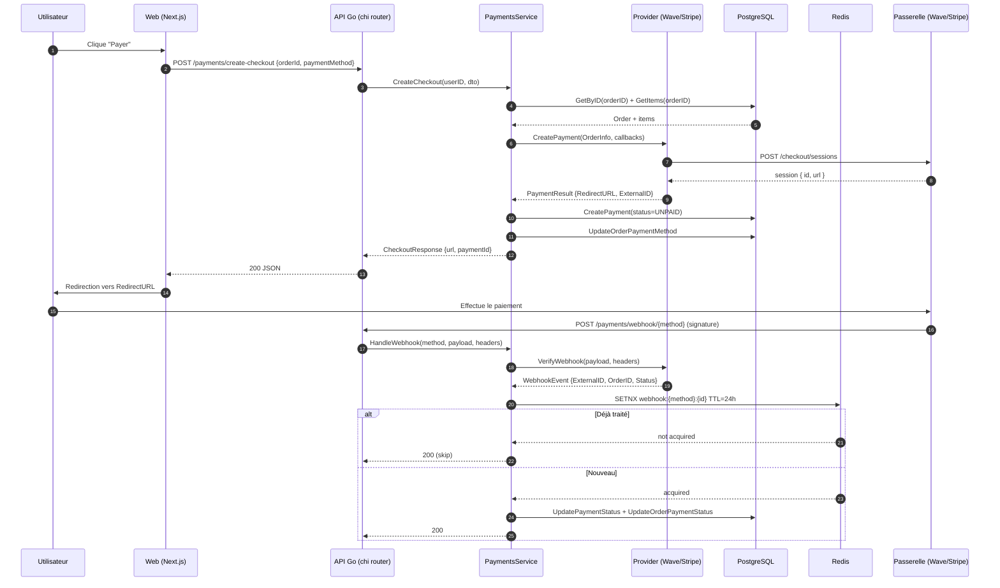

# Payment Integration — Wave & Stripe

Documentation technique et fonctionnelle de l'intégration des passerelles de paiement dans le backend Go de **RBS Crew SN**.

Ce document reflète l'état réel du code au moment de sa rédaction (fichiers `internal/payment/*.go`, `internal/service/payments.go`, `internal/handler/payments.go`, `internal/config/config.go`, `internal/router/router.go`). Les écarts entre le code et le comportement idéal sont listés dans l'annexe [Gaps & TODOs](#gaps--todos).

---

## Overview

### Méthodes de paiement supportées

L'énumération `payment.Method` (`internal/payment/provider.go`) déclare quatre méthodes :

| Constante Go       | Valeur (string)  | Statut d'implémentation                                 |
|--------------------|------------------|---------------------------------------------------------|
| `MethodStripe`     | `"STRIPE"`       | Implémenté (`internal/payment/stripe.go`)               |
| `MethodPayPal`     | `"PAYPAL"`       | Route de webhook exposée, adaptateur non fourni ici     |
| `MethodWave`       | `"WAVE"`         | Implémenté (`internal/payment/wave.go`)                 |
| `MethodOrangeMoney`| `"ORANGE_MONEY"` | Route de webhook exposée, adaptateur non fourni ici     |

Ce document couvre uniquement **Wave** et **Stripe**, les deux adaptateurs présents dans la base de code Go.

### Architecture

L'architecture suit un pattern **Provider Interface → Adapter → Service → Handler HTTP** :

```
┌──────────────────┐  HTTP  ┌────────────────────┐
│  Client (Next.js)│ ─────► │ PaymentsHandler    │
└──────────────────┘        │ (handler/payments) │
                            └─────────┬──────────┘
                                      │
                                      ▼
                          ┌────────────────────────┐
                          │ PaymentsService        │
                          │ (service/payments.go)  │
                          │  - CreateCheckout      │
                          │  - HandleWebhook       │
                          │  - Redis dedupe (SETNX)│
                          └─────────┬──────────────┘
                                    │
                    ┌───────────────┼────────────────┐
                    ▼               ▼                ▼
             ┌────────────┐  ┌────────────┐   ┌──────────────┐
             │Provider IF │  │StripeProv. │   │ WaveProvider │
             │ (Name /    │  │(stripe.go) │   │  (wave.go)   │
             │  Create /  │  └────────────┘   └──────────────┘
             │  Verify)   │
             └────────────┘
```

L'interface est définie ainsi (`internal/payment/provider.go`) :

```go
type Provider interface {
    Name() Method
    CreatePayment(ctx context.Context, order OrderInfo, callbacks CallbackURLs) (*PaymentResult, error)
    VerifyWebhook(ctx context.Context, payload []byte, headers http.Header) (*WebhookEvent, error)
}
```

Le `PaymentsService` maintient une `map[Method]Provider` et route dynamiquement les appels vers l'adaptateur approprié en fonction du champ `paymentMethod` reçu.

### Diagramme de séquence — Checkout complet



---

## Wave

### Contexte fonctionnel

Wave est le principal acteur de **mobile money** au Sénégal (et dans plusieurs pays d'Afrique de l'Ouest). Il offre le transfert d'argent gratuit entre particuliers et propose une **API Business** pour les marchands e-commerce et prestataires de services.

Caractéristiques clefs pour l'intégration RBS Crew :

- Devise unique côté Wave : **XOF** (Franc CFA), **sans décimales** — les montants sont des entiers.
- Flux **checkout hébergé** : Wave génère une URL (`wave_launch_url`) vers laquelle rediriger le client ; le paiement se déroule dans l'app mobile Wave.
- Notifications côté marchand via **webhooks HTTPS** signés en HMAC-SHA256.
- Documentation officielle : <https://docs.wave.com/business>

Wave est la méthode par défaut pour la clientèle locale sénégalaise, tandis que Stripe est réservée aux paiements internationaux par carte.

### Variables d'environnement

Extraites de `internal/config/config.go` :

| Variable            | Utilisation                                                             | Obligatoire | Défaut |
|---------------------|-------------------------------------------------------------------------|-------------|--------|
| `WAVE_API_KEY`      | Bearer token pour l'appel serveur → Wave (header `Authorization`)       | Oui         | `""`   |
| `WAVE_SECRET_KEY`   | Clé HMAC pour vérifier les webhooks entrants (header `Wave-Signature`)  | Oui         | `""`   |

> **Note :** `WAVE_BASE_URL` n'est **pas** exposé comme variable d'environnement. L'URL de base est **codée en dur** dans `NewWaveProvider` à `https://api.wave.com`. Voir [Gaps & TODOs](#gaps--todos).

### Endpoints Wave utilisés

| Opération              | Méthode | Endpoint                       | Note                                              |
|------------------------|---------|--------------------------------|---------------------------------------------------|
| Création de session    | POST    | `/v1/checkout/sessions`        | Retourne `id` et `wave_launch_url`                |
| Polling de statut      | —       | Non implémenté                 | Le service se repose entièrement sur le webhook   |
| Réception webhook      | POST    | `/webhooks/wave` (côté RBS)    | Signé HMAC-SHA256 (`Wave-Signature`)              |

### Payload de création de session (envoyé par le backend)

Depuis `WaveProvider.CreatePayment` (`internal/payment/wave.go`) :

```json
{
  "amount": "15000",
  "currency": "XOF",
  "error_url": "https://rbscrew.sn/paiement/echec",
  "success_url": "https://rbscrew.sn/paiement/succes",
  "client_reference": "order-uuid-123"
}
```

Points importants :

- `amount` est envoyé en **string** contenant un entier (via `fmt.Sprintf("%d", order.Total)`).
- La devise est **forcée à `XOF`** dans le payload Wave, indépendamment de la devise de la commande. C'est cohérent avec l'usage local mais empêche les commandes multi-devises via Wave.
- `client_reference` reçoit l'ID interne de la commande — c'est ce qui permet de relier le webhook à la bonne commande.

### Flux de paiement Wave

1. **Client** appelle `POST /payments/create-checkout` avec `{orderId, paymentMethod: "WAVE", successUrl, cancelUrl}` (nécessite JWT).
2. **`PaymentsService.CreateCheckout`** valide la commande (existence, appartenance à l'utilisateur, non déjà payée) et récupère les lignes.
3. Les montants sont convertis : pour `XOF`, `unitPrice = item.UnitPrice.IntPart()` (partie entière du `decimal`). Pas de multiplication par 100.
4. `WaveProvider.CreatePayment` fait `POST https://api.wave.com/v1/checkout/sessions` avec le payload ci-dessus.
5. La réponse est décodée : `{ id, wave_launch_url }`. Le champ `wave_launch_url` devient `RedirectURL`.
6. Le service persiste un enregistrement `payment` en statut `UNPAID` avec `externalId = session.id`.
7. Le service met à jour la méthode de paiement de la commande.
8. Le handler renvoie `{ url, paymentMethod, paymentId }` → le front redirige.
9. L'utilisateur paie dans l'app Wave.
10. Wave envoie `POST /payments/webhook/wave` avec le header `Wave-Signature` et un body JSON.
11. `WaveProvider.VerifyWebhook` vérifie la signature en HMAC-SHA256 avec `WAVE_SECRET_KEY`, puis parse l'événement.
12. `PaymentsService.HandleWebhook` applique la déduplication Redis (24h) puis met à jour la commande et le paiement.

### Vérification de la signature Wave

Implémentée dans `WaveProvider.VerifyWebhook` :

```go
mac := hmac.New(sha256.New, []byte(w.secretKey))
mac.Write(payload)
expectedSig := hex.EncodeToString(mac.Sum(nil))
if !hmac.Equal([]byte(signature), []byte(expectedSig)) { ... }
```

- Le HMAC est calculé sur **le corps brut** (raw body). Le handler utilise `io.ReadAll` sur `r.Body` avant appel — pas de re-encodage.
- La comparaison est en **temps constant** via `hmac.Equal`.
- Le nom de header attendu est **exactement** `Wave-Signature`.

### Événements Wave consommés

Depuis le `switch` de `VerifyWebhook` (`wave.go`) :

| Type d'événement                    | Statut interne mappé |
|-------------------------------------|----------------------|
| `checkout.session.completed`        | `PAID`               |
| `checkout.session.expired`          | `FAILED`             |
| `checkout.session.failed`           | `FAILED`             |
| *(autres)*                          | Ignoré silencieusement (retourne `nil, nil`) |

Le payload attendu :

```json
{
  "type": "checkout.session.completed",
  "data": {
    "id": "cs_XXX",
    "client_reference": "order-uuid-123",
    "checkout_status": "completed"
  }
}
```

### Tests locaux

1. **Tunnel public** — Wave doit atteindre votre machine :
   ```bash
   ngrok http 4000
   # ou : cloudflared tunnel --url http://localhost:4000
   ```
2. Enregistrer l'URL publique dans le dashboard marchand Wave : `https://<sub>.ngrok.io/payments/webhook/wave`.
3. Placer les clés sandbox dans `.env` :
   ```env
   WAVE_API_KEY=wave_sandbox_...
   WAVE_SECRET_KEY=<hmac_secret>
   ```
4. Créer une commande, appeler `/payments/create-checkout`, suivre le `url` retourné.
5. Simuler un webhook manuellement (signature calculée) :
   ```bash
   PAYLOAD='{"type":"checkout.session.completed","data":{"id":"cs_test_123","client_reference":"ORDER_ID","checkout_status":"completed"}}'
   SIG=$(printf '%s' "$PAYLOAD" | openssl dgst -sha256 -hmac "$WAVE_SECRET_KEY" -hex | awk '{print $2}')
   curl -X POST http://localhost:4000/payments/webhook/wave \
     -H "Content-Type: application/json" \
     -H "Wave-Signature: $SIG" \
     -d "$PAYLOAD"
   ```

### Pièges fréquents (Wave)

- **Montants décimaux refusés** — Wave n'accepte que des entiers XOF. Si `order.Total.IntPart()` tronque un montant avec décimales, la conversion silencieuse peut créer un écart avec le montant affiché au client. Toute la logique métier doit garantir que les prix XOF sont stockés sans décimales.
- **Header sensible à la casse** — le handler utilise `r.Header.Get("Wave-Signature")`, ce qui est insensible à la casse côté Go, mais assurez-vous que le dashboard Wave transmet bien un header nommé ainsi.
- **Devise forcée à XOF** — le `payload` Wave écrase `order.Currency`. Si vous créez une commande en EUR et choisissez Wave, le montant XOF sera envoyé mais le client ne l'aura pas payé en EUR.
- **Pas d'idempotency-key sur `POST /v1/checkout/sessions`** — un double clic peut créer deux sessions. Ajouter un header `Idempotency-Key` (voir Gaps).
- **Le `client_reference` doit être l'`order.ID`** — sinon le webhook ne pourra pas retrouver la commande.
- **Absence de `WAVE_BASE_URL`** — impossible de basculer sur un environnement sandbox distinct sans recompiler (voir Gaps).

---

## Stripe

### Contexte fonctionnel

Stripe est le fournisseur international de paiement par carte utilisé par RBS Crew pour les clients hors zone XOF (Europe, Amérique du Nord, etc.). L'intégration utilise **Stripe Checkout** (page hébergée par Stripe) plutôt que Payment Intents directes, ce qui simplifie la conformité PCI et supporte nativement :

- Cartes bancaires (Visa, Mastercard, Amex).
- Apple Pay et Google Pay (activables depuis le dashboard).
- Authentification forte 3DS2 obligatoire dans l'UE.
- Multi-devises (EUR, USD, GBP, XOF le cas échéant).

Documentation : <https://stripe.com/docs/payments/checkout>

### Variables d'environnement

Depuis `internal/config/config.go` :

| Variable                 | Utilisation                                                | Obligatoire | Défaut |
|--------------------------|------------------------------------------------------------|-------------|--------|
| `STRIPE_SECRET_KEY`      | Clé API serveur (`sk_test_...` ou `sk_live_...`)           | Oui         | `""`   |
| `STRIPE_WEBHOOK_SECRET`  | Secret de webhook (`whsec_...`) pour `ConstructEvent`      | Oui         | `""`   |
| `STRIPE_PUBLISHABLE_KEY` | Clé publique client. **Non lue** par le backend Go ; référencée dans `.env.example` pour le frontend. | Front-only | `""` |

### Endpoints / SDK utilisés

L'implémentation utilise **`github.com/stripe/stripe-go/v82`** — pas de HTTP direct :

| Opération                     | Fonction SDK                                        |
|-------------------------------|-----------------------------------------------------|
| Création de session Checkout  | `checkout/session.New(*stripe.CheckoutSessionParams)` |
| Vérification webhook          | `webhook.ConstructEvent(payload, sig, secret)`      |

Le `stripe.Key` global est initialisé dans `NewStripeProvider`.

### Payload envoyé à Stripe (résumé)

```go
&stripe.CheckoutSessionParams{
    PaymentMethodTypes: []string{"card"},
    Mode:               "payment",
    SuccessURL:         callbacks.SuccessURL,
    CancelURL:          callbacks.CancelURL,
    ClientReferenceID:  order.ID,
    CustomerEmail:      order.Email, // si non vide
    LineItems:          [...]{PriceData:{Currency, ProductData:{Name}, UnitAmount}, Quantity},
}
```

Points importants :

- `Mode: "payment"` (paiement unique, pas d'abonnement).
- `PaymentMethodTypes: ["card"]` uniquement — Apple/Google Pay non activés au niveau de l'API (l'activation se fait via dashboard mais le paramétrage explicite ici pourrait les bloquer). Voir Gaps.
- **`ClientReferenceID = order.ID`** — indispensable pour relier le webhook à la commande.
- Les **frais de livraison** sont ajoutés comme une ligne supplémentaire nommée `"Frais de livraison"` avec quantité 1.

### Conversion des montants

Dans `PaymentsService.CreateCheckout` :

```go
unitPrice := item.UnitPrice.IntPart() // XOF = pas de décimales
if order.Currency != "XOF" {
    unitPrice = item.UnitPrice.Mul(decimal.NewFromInt(100)).IntPart()
}
```

- **XOF** : montant entier tel quel.
- **EUR/USD/autres** : multiplication par 100 pour envoyer en **plus petite unité** (centimes).

### Flux de paiement Stripe

1. Client authentifié `POST /payments/create-checkout` avec `{orderId, paymentMethod: "STRIPE", successUrl, cancelUrl}`.
2. `PaymentsService.CreateCheckout` valide, prépare `OrderInfo` en centimes.
3. `StripeProvider.CreatePayment` appelle `session.New(params)`.
4. Réponse : `sess.URL` (URL de Checkout Stripe) et `sess.ID`.
5. Persistance en base d'un `payment` en `UNPAID` avec `externalId = sess.ID`.
6. Réponse au front : `{ url, paymentMethod, paymentId }`.
7. Client redirigé vers Stripe Checkout (SCA / 3DS2 le cas échéant).
8. Après paiement, Stripe redirige vers `successUrl` et envoie un webhook.
9. `POST /payments/webhook/stripe` (ou `/payments/webhook` pour l'ancien chemin) est reçu.
10. `webhook.ConstructEvent(payload, r.Header.Get("Stripe-Signature"), STRIPE_WEBHOOK_SECRET)` vérifie et parse.
11. `PaymentsService.HandleWebhook` applique le dedupe Redis puis met à jour commande + paiement.

### Événements Stripe consommés

Depuis `StripeProvider.VerifyWebhook` :

| Type d'événement                | Champs lus                              | Statut interne mappé |
|---------------------------------|-----------------------------------------|----------------------|
| `checkout.session.completed`    | `sess.ID`, `sess.ClientReferenceID`     | `PAID`               |
| `checkout.session.expired`      | `sess.ID`, `sess.ClientReferenceID`     | `FAILED`             |
| `charge.refunded`               | `charge.PaymentIntent.ID` (comme `ExternalID`) | `REFUNDED`    |
| *(autres)*                      | Ignoré silencieusement (`nil, nil`)     | —                    |

> **À noter :** les événements `payment_intent.succeeded` et `payment_intent.payment_failed` ne sont **pas** gérés dans l'implémentation actuelle. Pour Stripe Checkout en mode `payment` c'est acceptable — `checkout.session.completed` suffit. Voir Gaps si vous ajoutez le flux Payment Intents directes.

### Vérification de signature

- `stripe-go/webhook.ConstructEvent` fait tout : parse du header `Stripe-Signature` (avec `t=` et `v1=`), vérifie la tolérance temporelle, calcule le HMAC-SHA256.
- **Le body doit être lu brut** (pas de `json.Decode`). Le handler `WebhookFor` fait `io.ReadAll(r.Body)` avec `MaxBytesReader(65536)` — conforme.

### Tests locaux avec Stripe CLI

1. Installer Stripe CLI : <https://stripe.com/docs/stripe-cli>.
2. Login :
   ```bash
   stripe login
   ```
3. Écouter et forwarder :
   ```bash
   stripe listen --forward-to localhost:4000/payments/webhook/stripe
   ```
   La CLI affiche un `webhook signing secret` (`whsec_...`) — le placer dans `STRIPE_WEBHOOK_SECRET`.
4. Déclencher un événement de test :
   ```bash
   stripe trigger checkout.session.completed
   stripe trigger charge.refunded
   ```

### Cartes de test Stripe

| Carte                 | Résultat                       |
|-----------------------|--------------------------------|
| `4242 4242 4242 4242` | Succès                         |
| `4000 0025 0000 3155` | Requiert 3DS2                  |
| `4000 0000 0000 9995` | Fonds insuffisants             |
| `4000 0000 0000 0002` | Refus générique                |

Toutes acceptent n'importe quelle date future et n'importe quel CVC.

### Pièges fréquents (Stripe)

- **Body raw obligatoire** — toute middleware qui parserait le body avant `ConstructEvent` casse la signature. Le handler actuel utilise `io.ReadAll` correctement.
- **Devise en plus petite unité** — 10 EUR se déclare `unitAmount: 1000`. Une confusion avec XOF (pas de multiplication) est un piège classique — le code gère bien le cas via le branchement `order.Currency != "XOF"`.
- **Clés live vs test** — un paiement effectué en environnement test avec une clé live débitera vraiment le client. Ne jamais mélanger.
- **`Stripe-Signature` requis** — sans header, `ConstructEvent` renvoie une erreur et la requête est rejetée en 400.
- **`ClientReferenceID` limité à 200 chars** — l'ID interne (UUID) tient largement.
- **Tolérance de temps par défaut : 5 minutes** — un serveur avec une horloge décalée rejettera les webhooks.
- **`payment_intent.*` ignoré** — si un jour on bascule sur Payment Intents directes, il faudra étendre `VerifyWebhook`.

---

## Idempotency

### Mécanisme

Implémenté dans `PaymentsService.HandleWebhook` (`internal/service/payments.go`) :

```go
dedupeID := event.ExternalID
if dedupeID == "" {
    dedupeID = event.OrderID
}
if dedupeID != "" {
    key := fmt.Sprintf("webhook:%s:%s", method, dedupeID)
    acquired, err := s.cache.SetNX(ctx, key, "1", webhookDedupeTTL)
    // ...
}
```

- **Format de clé** : `webhook:{method}:{dedupeID}`. Exemples :
  - `webhook:STRIPE:cs_test_a1b2c3`
  - `webhook:WAVE:cs_XYZ`
- **Fallback** : si `event.ExternalID` est vide (rare), on utilise `event.OrderID`. Si les deux sont vides, aucun dedupe n'est appliqué (l'événement passe).
- **TTL** : `webhookDedupeTTL = 24 * time.Hour`. Suffisant : les fournisseurs retentent typiquement sur 24-72h mais les rejeu utiles se concentrent dans les premières heures.
- **Opération** : `SETNX` (SET if Not eXists) — atomique. Si la clé existe déjà, `acquired == false` → l'événement est ignoré silencieusement (log `webhook already processed — skipping`).

### Comportement quand Redis est indisponible

- `SetNX` renvoie une erreur → un `slog.Warn("webhook dedupe SETNX failed", ...)` est émis puis on **continue** l'exécution.
- Politique **fail-open** : préférer traiter deux fois (idempotent au niveau DB via `UpdateOrderPaymentStatus`, cf. transitions d'état) plutôt que perdre un paiement.
- Le service tolère aussi `s.cache == nil` (constructeur qui n'aurait pas fourni Redis).

### Recommandation

Les mises à jour SQL en aval devraient être idempotentes par nature (transition d'état contrôlée : `UNPAID → PAID`, pas de replay latéral). Si vous ajoutez des side-effects non idempotents (envoi email, décrément stock), les protéger par la même clé ou par une flag DB.

---

## Environment setup checklist

### Développement local

- [ ] `DATABASE_URL` — Postgres accessible
- [ ] `REDIS_URL` — Redis accessible (sinon dedupe désactivé)
- [ ] `JWT_SECRET` + `JWT_REFRESH_SECRET` — nécessaires même pour tester les paiements (route `/payments/create-checkout` est protégée)
- [ ] `APP_URL` — utilisé pour les redirections success/cancel côté front
- [ ] **Stripe** :
  - [ ] `STRIPE_SECRET_KEY=sk_test_...`
  - [ ] `STRIPE_WEBHOOK_SECRET=whsec_...` (obtenu via `stripe listen`)
  - [ ] `STRIPE_PUBLISHABLE_KEY=pk_test_...` (côté front)
- [ ] **Wave** :
  - [ ] `WAVE_API_KEY=<sandbox_key>`
  - [ ] `WAVE_SECRET_KEY=<hmac_secret>`
- [ ] Tunnel public (`ngrok`, `cloudflared`) pour recevoir les webhooks

### Production

- [ ] `STRIPE_SECRET_KEY=sk_live_...` (⚠ ne jamais commiter)
- [ ] `STRIPE_WEBHOOK_SECRET=whsec_...` (créé dans le dashboard Stripe → Developers → Webhooks)
- [ ] `WAVE_API_KEY` + `WAVE_SECRET_KEY` en clés de production Wave
- [ ] Webhook URLs enregistrés dans les dashboards fournisseurs :
  - Stripe : `https://api.rbscrew.sn/payments/webhook/stripe`
  - Wave : `https://api.rbscrew.sn/payments/webhook/wave`
- [ ] Événements activés côté Stripe : `checkout.session.completed`, `checkout.session.expired`, `charge.refunded`
- [ ] Redis en HA (ou au minimum persisté) pour maintenir la fenêtre de dedupe
- [ ] Certificat TLS valide sur `api.rbscrew.sn` (les fournisseurs refusent les endpoints non-HTTPS ou auto-signés)

Référence : le fichier `/.env.example` à la racine du repo contient les clés Stripe ; **Wave doit y être ajouté** — actuellement absent (voir Gaps).

---

## Deployment notes

### Accessibilité des webhooks

- Les URLs de webhook doivent être **publiquement joignables sur Internet en HTTPS**.
- En local : `ngrok http 4000` ou `cloudflared tunnel --url http://localhost:4000`.
- En prod : reverse-proxy (nginx / Caddy / Traefik) devant le service Go, avec certificat valide.

### Rate limiting

- Les routes `/payments/webhook/*` sont dans le groupe **public** mais le code les commente comme *"exempt from generic rate limiting"*. En réalité, le `r.Use(middleware.RateLimit(...))` du groupe s'applique à toutes les routes déclarées **après**. Vérifier : au vu du router, `RateLimit(1, 20)` s'applique au groupe entier. Voir Gaps.
- Stripe et Wave peuvent envoyer des rafales lors de rejeux. Prévoir une exception (route Group séparée) ou augmenter la burst.
- `MaxBodyBytes = 65536` (64 KB) est appliqué sur les webhooks — suffisant pour Stripe/Wave mais à surveiller si de futures méthodes envoient des payloads plus gros.

### Retry / DLQ

- **Stripe** : rejeu automatique sur ~72h avec backoff exponentiel si le serveur ne renvoie pas 2xx.
- **Wave** : politique de rejeu non documentée publiquement — considérer que tout non-2xx entraîne un rejeu.
- Le service actuel **renvoie 200** même sur événement non géré (`event == nil`) ou déjà dédupliqué — comportement souhaité pour éviter des rejeux inutiles.
- Pas de DLQ interne : si l'update DB échoue en `PAID`, `HandleWebhook` renvoie `types.InternalError` → 500 → le fournisseur rejouera. C'est le comportement voulu.

### Rate limits fournisseurs

- **Stripe** : ~100 req/sec sur les endpoints Live (soft-limit). Le flux checkout n'atteint jamais ce niveau à l'échelle RBS Crew.
- **Wave** : non documenté publiquement. Un throttle applicatif préventif côté client (Go) peut être ajouté si volumétrie forte.

---

## Troubleshooting

| Symptôme                                                            | Cause probable                                                                                        | Correctif                                                                                         |
|---------------------------------------------------------------------|-------------------------------------------------------------------------------------------------------|---------------------------------------------------------------------------------------------------|
| `400 Bad Request` sur `/payments/webhook/stripe`                    | Signature invalide : mauvais `STRIPE_WEBHOOK_SECRET`, body altéré par middleware, horloge décalée     | Vérifier le secret (`stripe listen` en local), s'assurer que le body est lu **avant** tout parse, synchroniser l'heure serveur (`chronyd` / `ntpd`) |
| `400` sur `/payments/webhook/wave` avec `invalid webhook signature` | `WAVE_SECRET_KEY` erroné, ou signature calculée sur une représentation encodée différente             | Recalculer manuellement le HMAC-SHA256 sur le body brut hex-encodé et comparer                    |
| Le webhook arrive mais la commande n'est pas mise à jour            | `orderID` introuvable : `client_reference` / `ClientReferenceID` absent, session créée hors ce backend | Vérifier que `order.ID` est bien passé lors de `CreatePayment`. Consulter `GetPaymentByExternalID` |
| Commande marquée `PAID` deux fois                                    | Redis down au moment du premier webhook + rejeu du fournisseur                                        | Vérifier que Redis est up ; les transitions DB sont idempotentes donc pas de double débit         |
| Montant Stripe erroné (ex : 100× trop cher)                          | Confusion cents / euros : `unitPrice` non multiplié par 100 pour EUR, ou multiplié pour XOF           | Auditer la logique `order.Currency != "XOF"` dans `service/payments.go`                            |
| Wave rejette la session avec 4xx                                     | Montant décimal, `client_reference` manquant, header `Authorization` mal formé                        | Vérifier que le champ `amount` est un entier stringifié ; retester avec `curl` direct              |
| `STRIPE_SECRET_KEY` live utilisé en dev                              | `.env` de dev copié depuis prod                                                                       | Utiliser `sk_test_...` en dev ; segmenter les `.env` par environnement                             |
| Webhook `checkout.session.expired` n'annule pas la commande         | La logique met bien `FAILED` mais le front peut cacher un ancien statut                               | Rafraîchir la commande côté client ; vérifier le websocket/SSE si utilisé                          |
| Redis warn `webhook dedupe SETNX failed`                             | Redis indisponible                                                                                    | Fail-open par design ; investiguer la santé Redis en dehors du flux paiement                       |
| `Unknown payment method` sur checkout                                | Le provider n'a pas été enregistré au démarrage (Wave/Stripe absent du slice passé à `NewPaymentsService`) | Vérifier l'initialisation dans `cmd/api/main.go`                                                    |

---

## References

### Documentation externe

- Wave Business API : <https://docs.wave.com/business>
- Wave Checkout Sessions : <https://docs.wave.com/business/api/checkout-sessions>
- Stripe Checkout : <https://stripe.com/docs/payments/checkout>
- Stripe Webhooks : <https://stripe.com/docs/webhooks>
- Stripe Go SDK : <https://github.com/stripe/stripe-go>
- Stripe CLI : <https://stripe.com/docs/stripe-cli>

### Fichiers du dépôt

- Interface & types : `apps/api-go/internal/payment/provider.go`
- Adaptateur Stripe : `apps/api-go/internal/payment/stripe.go`
- Adaptateur Wave : `apps/api-go/internal/payment/wave.go`
- Orchestration + webhook handler : `apps/api-go/internal/service/payments.go`
- Handler HTTP : `apps/api-go/internal/handler/payments.go`
- Configuration : `apps/api-go/internal/config/config.go`
- Router (routes `/payments/*`) : `apps/api-go/internal/router/router.go`
- Exemple env global : `.env.example` (racine du repo)

---

## Gaps & TODOs

Écarts constatés entre le code lu et un état de production idéal :

### Configuration

- **`WAVE_BASE_URL` codé en dur** dans `NewWaveProvider` (`https://api.wave.com`). Impossible de pointer vers un endpoint sandbox / mock sans recompiler. → Exposer une variable d'environnement optionnelle avec ce défaut.
- **`.env.example` racine du repo n'inclut pas `WAVE_API_KEY` ni `WAVE_SECRET_KEY`.** Seule Stripe y est listée. Les développeurs qui découvrent le projet ne sauront pas quelles variables Wave activer.
- **`apps/api-go/env.example` ne contient que les vars admin de seed** — il ne documente aucune variable de paiement. Envisager un fichier `.env.example` complet côté backend.

### Wave

- **Absence d'`Idempotency-Key`** sur `POST /v1/checkout/sessions`. Double-clic utilisateur → double session Wave.
- **Devise forcée à `XOF`** dans le payload : le champ `order.Currency` est ignoré. Pas de guard-rail explicite → une commande EUR + méthode Wave passera silencieusement.
- **`_ = order.Currency`** — `Currency` est présent dans `OrderInfo` mais non utilisé par `WaveProvider`. À documenter ou à valider explicitement.
- **Pas de gestion de `checkout.session.refunded`** (si Wave propose ce type).
- **Pas de polling de statut** — si un webhook est perdu, aucune récupération. Ajouter un job périodique qui interroge Wave sur les paiements `UNPAID` de plus de N minutes.
- **Timeout HTTP fixe à 30s** — pas de retry sur erreur transitoire.

### Stripe

- **`PaymentMethodTypes: ["card"]` explicite** — bloque potentiellement Apple/Google Pay activés au dashboard. Envisager d'omettre le champ pour laisser Stripe choisir.
- **`payment_intent.succeeded` / `payment_intent.payment_failed` non gérés** — acceptable pour Checkout en mode `payment`, mais bloquant si migration vers Payment Intents.
- **Pas de mapping fin des erreurs** — `session.New` peut échouer pour de multiples raisons (rate limit, clé invalide, montant hors limites). Toutes remontent en `500`.
- **`charge.refunded` utilise `charge.PaymentIntent.ID` comme `ExternalID`** alors que la création utilise `sess.ID`. Le lookup `GetPaymentByExternalID` échouera. Nécessite une jointure supplémentaire ou de stocker aussi le PaymentIntent ID. À vérifier / corriger.

### Handler & routing

- **Rate limiter sur les webhooks** — le commentaire dit *"exempt from generic rate limiting"* mais le middleware `RateLimit(rate.Limit(1), 20)` est appliqué au groupe public dans lequel les webhooks sont déclarés. Sous rejeu massif, Stripe/Wave pourraient hitter le limiter. Sortir les webhooks dans un groupe dédié sans throttle (ou avec throttle plus généreux par IP fournisseur).
- **Route legacy `POST /payments/webhook`** — pointe vers Stripe. À déprécier une fois la migration terminée.
- **Absence de handler pour PayPal / Orange Money** — les routes existent (`WebhookFor(payment.MethodPayPal)`) mais aucun adaptateur n'est enregistré dans `PaymentsService` (à vérifier dans `cmd/api/main.go`). Le service renverra `Unknown payment method`.

### Service

- **`CreatePayment` échoue silencieusement en base** — commentaire `"Continue anyway — we'll reconcile via webhook"`. Le webhook mettra à jour un `payment` inexistant, `GetPaymentByExternalID` échouera, le fallback `GetOrderByStripeSession` prendra le relais mais on perd la table `payment`. Rendre l'insertion critique ou provisionner un enregistrement même vide.
- **`GetOrderByStripeSession` en fallback** — dette technique pour compatibilité avec un ancien schéma. À supprimer après migration complète.
- **Pas de log structuré du montant / devise** au moment de la création — utile pour audit.
- **Aucun test unitaire visible** pour `PaymentsService.HandleWebhook`. La logique de dedupe et de mapping de statut mériterait une suite de tests.

### Sécurité

- **HMAC comparaison sur strings** — `hmac.Equal([]byte(signature), []byte(expectedSig))` est OK si les deux ont la même longueur ; s'ils diffèrent, `hmac.Equal` renvoie `false` immédiatement. Pas de risque de timing attack, mais un contrôle de longueur explicite améliorerait la lisibilité.
- **Pas de validation de la fraîcheur des webhooks Wave** — Wave n'expose pas de timestamp signé (contrairement à Stripe qui a `t=`). Un attaquant qui capture un webhook légitime pourrait le rejouer. La déduplication Redis limite la fenêtre à 24h ; au-delà, le rejeu est possible. Envisager de logger `X-Request-ID` ou similaire si Wave le fournit.
